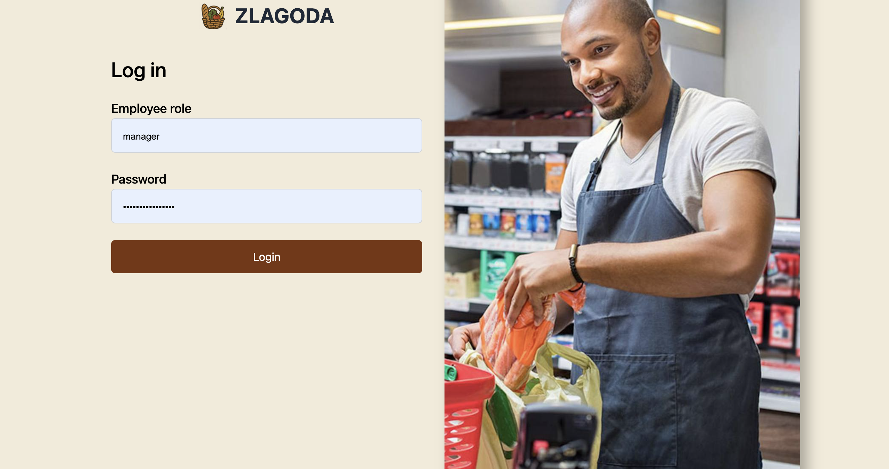
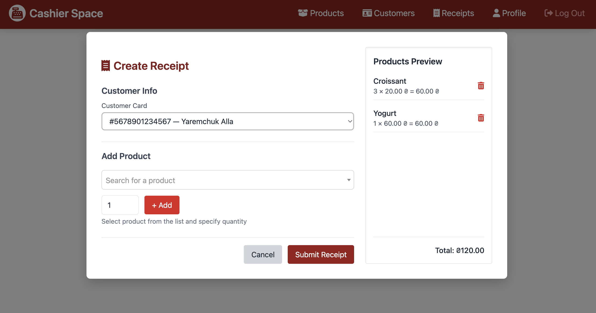
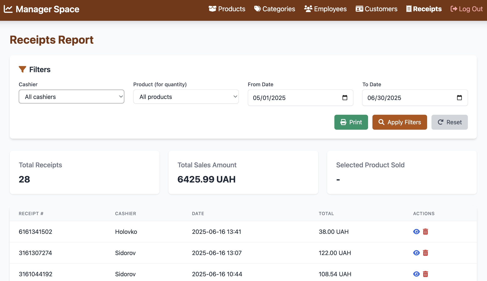

# Overview
A university project developed to manage the operations of a small grocery mini-supermarket named "Zlagoda".
It focuses on streamlining the product sales process and maintaining secure and efficient control over daily store activities.

## Screenshots
#### Authorization Page

#### Create Receipt Form (Cashier Dashboard)

#### Receipts Report (Manager Dashboard)

